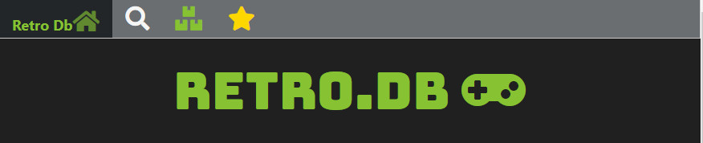

# RetroDb

RetroDb is a database and web server that is built from your Hyperspin / Rocketlauncher games lists and statistics.

WebServer / Client:

- Browse &amp; search all of your available imported games and favorites.
- Media files are served from your existing media directories
- Remote control Rocketlauncher including Pause menus

## Requirements

Dotnet runtime 2.1.500 (aka 2.1.6) - [https://dotnet.microsoft.com/download](https://dotnet.microsoft.com/download)

## Building

	powershell -f build.ps1

## Importing

See [Import ReadMe](src\User\RetroDbImporter.Console)

## Web Server / UI

#### Server Settings:

See **appsettings.json**

	  "ConnectionStrings": {
	    "DefaultConnection": "Data Source=C:\\programdata\\retrodb\\RetroDb.db"
	  },
	  "Hyperspin": {
	    "Enabled": true,
	    "InstallPath": "I:\\Hyperspin",
	    "MediaPath": ""
	  },
	  "Rocketlauncher": {
	    "InstallPath": "I:\\Rocketlauncher",
	    "MediaPath": ""
	  },
	  "Logging": {
	    "LogLevel": {
	      "Default": "Information",
	      "System": "Information",
	      "Microsoft": "Critical"
	    },
	    "Console": {
	      "IncludeScopes": true
	    }
	  }

You can create **C:\\programdata\\retrodb\\** and add your imported database here or anywhere you like if you change the DefaultConnetion.

##### Ports

See hosting.json

	{
	  "server.urls": "http://*:60776"
	}

#### Booting server

    dotnet Retrodb.server.dll

#### Using the client

Open browser after running the server and go to the Url set, eg:

	http://localhost:60776

---

#### Technical / About

Server/Client is built on an **experimental** framework named **Blazor**.

It's using "Server Side Blazor" which can produce latency issues depending on how far server is from client. ***On my tests this is fine for a local intranet.***
